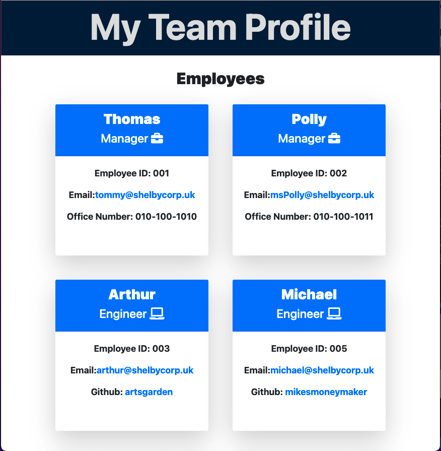

# Team Profile Generator
##  

## Table of Contents
- [Description](#description)
- [Mock-Up](#mock-up)
- [Installation](#installation)
- [Usage](#usage)
- [License](#license)
- [Contribution Guidelines](#contribution-guidelines)
- [Tests](#tests)
- [Links](#links)
- [Questions](#questions)

## [Description](#table-of-contents)
The Team Profile Generator application is a handy tool for any software engineering team’s manager, or employee, wanting to capture their team’s key information in one place, for easy reference. The Node.js command-line app takes the user’s input via prompt and generates a simply-styled html webpage capturing the team manager(s), engineer(s), and intern(s) name, employee ID, email address, as well as special info pertaining to each role – Office Number for managers, GitHub link for engineers and school name for interns. After user input is received, new class instances are created based on the employee role and the information is rendered to a bootstrap card and added to the main html rendering code prior to generating the final html file. For the team profile to be generated there is a minimum requirement of at least three employees total. If the user attempts to create a team with fewer than 3 employees, a console.log will warn them on the minimum team requirement and they will be given the prompts to add another employee.

## [Mock-Up](#table-of-contents)

Video Walkthrough: 
[Youtube Link for Video Walkthrough](https://youtu.be/3-Hi0WK9JpM)
[Google Drive Link for Video Walkthrough](https://drive.google.com/file/d/17AedgpVAQM-SBYOaNXL6V2ARIuR7RIF6/view?usp=sharing)

Responsive Design Mockups:

## [Installation](#table-of-contents)
Clone repository, npm install, npm test to run the test suite, and npm start to run inquirer for team profile generation.

## [Usage](#table-of-contents)
This application is intended to be used by any manager or teammember wanting to capture their teammates information in a single webpage for easy reference.

## [License](#table-of-contents)

[Apache 2.0 License](https://www.apache.org/licenses/LICENSE-2.0)

## [Contribution Guidelines](#table-of-contents)
Currently not accepting contributions.

## [Tests](#table-of-contents)
In your CLI input 'npm install' to ensure you have jest and inquirer installed for the repo, then 'npm test' to run the testing suite.

## [Links](#table-of-contents)
[Github Repository](https://github.com/jacih/Team-Profile-Generator)
[Staging Link]

## [Questions](#table-of-contents)
Contact me through [GitHub](https://github.com/jacih)
Contact me through email at: [jacqueline.e.hodgson@gmail.com](mailto:jacqueline.e.hodgson@gmail.com)
